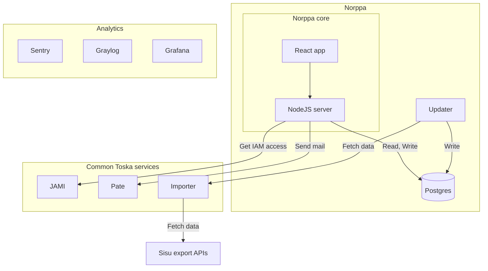

#  Palaute  

More commonly known as **Norppa**

The open source course feedback system used by University of Helsinki and Tampere University

Production in <https://norppa.helsinki.fi>

## Found a bug or have a feature request?

Write an issue if you find mistakes, problems or something to improve in Palaute.
Feel free to create a pull request.

## Contributing

### Environment configuration

Create a `.env` file inside the project's root directory. In that file, copy the contents of the `.env.template` file and add correct values for the variables based on the documentation.

### How users can get started with Palaute

Clone the repo, install docker to get started!

Before starting the project for the first time run `npm i` to install needed development dependencies.

To start the project in development mode use this command. It will start everything in development mode:

```bash
$ npm run start
```

### Stuck?

If stuck reset everything and start from a clean slate:

```bash
$ npm run reset
```

## Documentation

### Service architecture overview

The Norppa core in this repo consists of a NodeJS server and a React frontend, but the entire Norppa system is built of many more services. The following graph describes Norppa service implementation in UoH.



When implementing Norppa for your organisation, you will implement your own updater, jami, pate and possibly some kind of importer, as well as analytics.

### Topics

- [Accessibility](documentation/accessibility.md)
- [Entity schema](documentation/entity_diagram.md)
- [Oikeusryhmät](documentation/oikeusryhmat.md)
- [Norppa terminology](documentation/terminology.md)
- [Cronjobs](documentation/cronjobs.md)
- [Configuration](documentation/configuration.md)
- [Translations](documentation/translations.md)
- [Troubleshooting](documentation/troubleshooting.md)
- [Testing](documentation/testingdocument.md)
- [Deleted tables](documentation/deleted_tables.md)
- [Question data format](documentation/question_formats.md)
- [Feedback target visibility](documentation/feedback_target_visibility.md)

### Documentation guidelines

- Document whatever cannot be documented in code or needs visibility for a broader audience.
- The biggest and only crime is to not delete or update outdated documentation when you notice it. No need to ask for permission to do so.

### Documentation Feedback

Need something documented or see a problem in existing docs?
Please give feedback in the form of issues (add the documentation tag). All kinds of feedback is welcome from everyone reading the Norppa documentation.

## Maintainers 

**[Toska](https://toska.dev/)**

University of Helsinki.

## Credits

Seal emojis & gif by https://github.com/googlefonts/noto-emoji/ licenced under SIL

[norppa_holy_smoke.png](./src/client/assets/norppa_holy_smoke.png) by [tttriple](https://github.com/tttriple)
