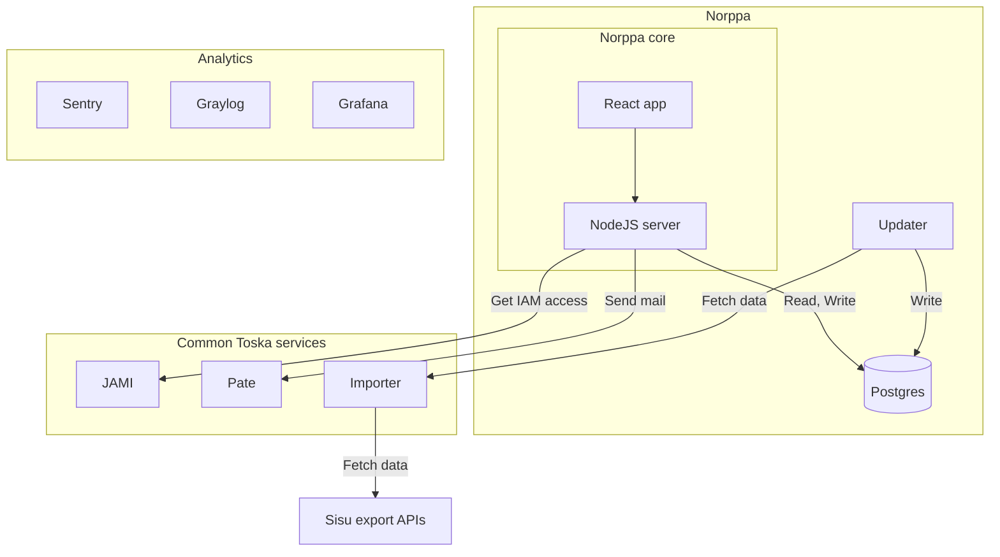

#  Palaute  

More commonly known as **Norppa**

The open-source course feedback system used by the University of Helsinki and Tampere University

Production in <https://norppa.helsinki.fi>

## Contributing

### Found a bug or have a feature request?

Write an issue if you find mistakes, problems or something to improve in Palaute.
Feel free to create a pull request.

### Commit guidelines

We like the [Conventional Commits specification](https://www.conventionalcommits.org/en/v1.0.0/).

## Running locally

Clone the repo, and install docker to get started!

Before starting the project for the first time run `npm i` to install development dependencies.

Start frontend, backend and [Jami](github.com/UniversityOfHelsinkiCS/jami) in development mode:

```bash
$ npm start
# or
$ docker compose up
```

To run tests, you can use these commands:

```bash
$ npm run test:cypress # Open Cypress UI
$ npm run test:setupLocal # Run the app with a test database
$ npm run test:run # Run all Cypress specs in headless mode
$ npm test # CI, build test app and run all specs. Slow!
```

To populate the Norppa and Jami databases from a backup in a remote server, use

```bash
./scripts/get_prod_db.sh
```

(If you're not in Toska, you can still use the script for reference)

### Environment configuration

Create a `.env` file inside the project's root directory. In that file, copy the contents of the `.env.template` file and add the correct values for the variables based on the documentation.

### High-level development guidelines

Use feature flags for large new features or changes. Define them in [configuration](documentation/configuration.md). This allows the different parties using Norppa to adopt new features at their own pace.

## Documentation

[Deepwiki](https://deepwiki.com/UniversityOfHelsinkiCS/palaute)

The source code and documentation in this repo is the only source of truth for the Norppa technicalities. The written docs are quite limited in scope. If you're using Norppa, we hope you aid in their improvement.

Need something documented or see a problem in existing docs? Do not hesitate to create an issue or a PR. All kinds of contributions are welcome from everyone reading the Norppa documentation.

### Service architecture overview

The Norppa core in this repo consists of a NodeJS server and a React frontend, but the entire Norppa system is built of many more services. The following graph describes Norppa service implementation in UoH.



When implementing Norppa for your organization, you will implement your own Updater, Jami, Pate, and possibly some kind of importer, as well as analytics.

### Topics

- [Accessibility](documentation/accessibility.md)
- [Entity schema](documentation/entity_diagram.md)
- [Oikeusryhmät](documentation/oikeusryhmat.md)
- [Norppa terminology](documentation/terminology.md)
- [Cronjobs](documentation/cronjobs.md)
- [Configuration](documentation/configuration.md)
- [Translations](documentation/translations.md)
- [Troubleshooting](documentation/troubleshooting.md)
- [Testing](documentation/testingdocument.md)
- [Deleted tables](documentation/deleted_tables.md)
- [Question data format](documentation/question_formats.md)
- [Feedback target visibility](documentation/feedback_target_visibility.md)

Maintained by **[Toska](https://toska.dev/)** 

Users and contributors:

University of Helsinki,

Tampere University

## Artwork credits

Seal emojis & gif by https://github.com/googlefonts/noto-emoji/ licenced under SIL

[norppa_holy_smoke.png](./src/client/assets/norppa_holy_smoke.png) by [tttriple](https://github.com/tttriple)
