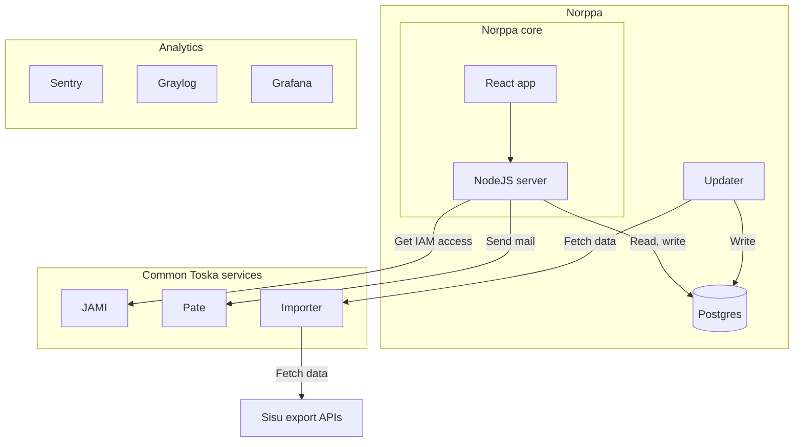

# Documentation

This is the index page for Norppa docs.

We plan to broadly document core topics suchs as entity schema, architecture and infrastructure, and maybe go over some more specific design decisions.

Data protection and accessibility documents are also considered.

## Topics

- [Entity schema](https://github.com/UniversityOfHelsinkiCS/palaute/blob/master/documentation/entity_diagram.md)
- [Access rights (Oikeusryhmät, in Finnish)](https://github.com/UniversityOfHelsinkiCS/palaute/blob/master/documentation/oikeusryhmat.md)
- [Norppa terminology](https://github.com/UniversityOfHelsinkiCS/palaute/blob/master/documentation/terminology.md)
- [Configuration](configuration.md)

## Service architecture

The Norppa core in this repo consists of a NodeJS server and a React frontend, but the entire Norppa system is built of many more services.

