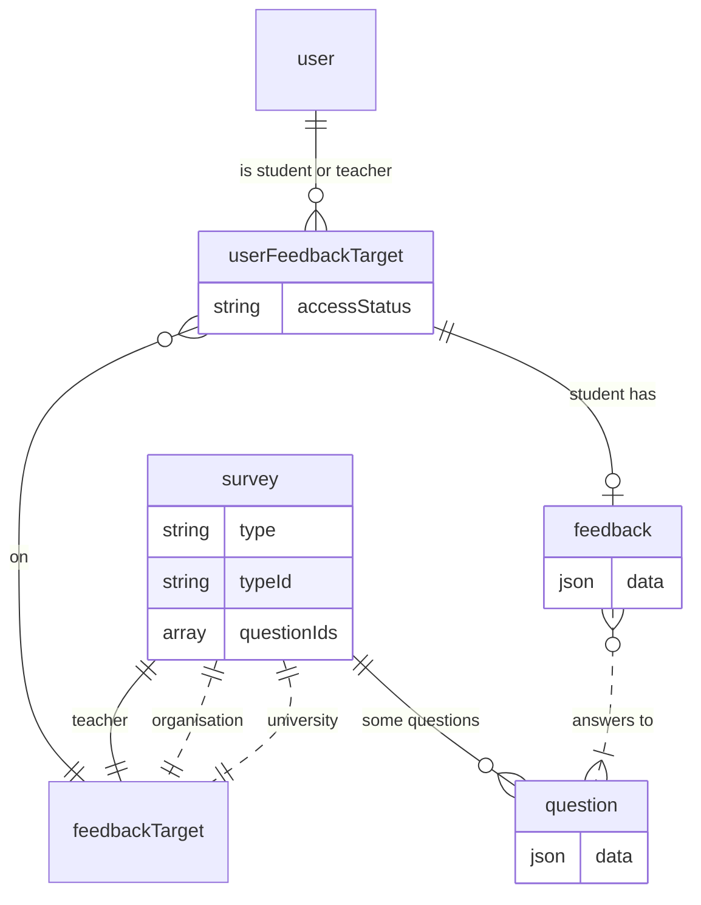
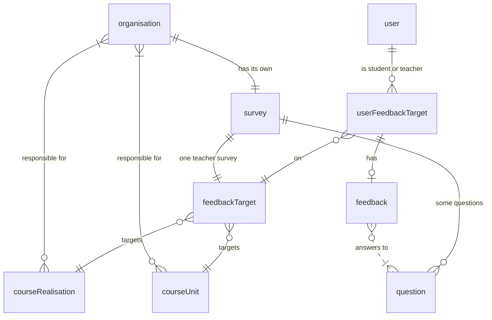
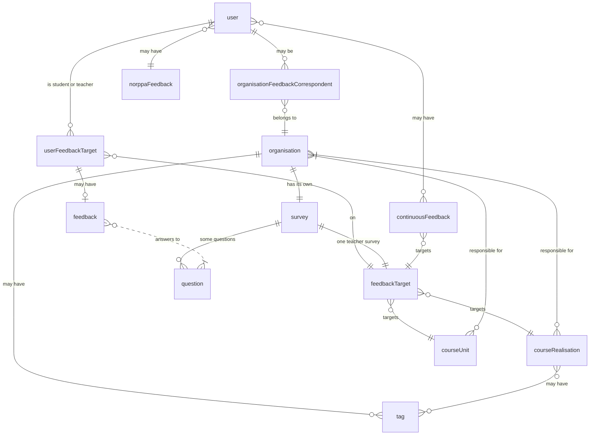

# Norppa entity diagram

## Basics

```mermaid
erDiagram
    user ||--o{ userFeedbackTarget : "is student or teacher"
    userFeedbackTarget }o--|| feedbackTarget : on
    userFeedbackTarget ||--o| feedback : "student has"
    userFeedbackTarget {
      string accessStatus
    }
    survey ||--|| feedbackTarget : "teacher"
    survey ||..|| feedbackTarget : "organisation"
    survey ||..|| feedbackTarget : "university"
    survey ||--o{ question : "some questions"
    survey {
      string type
      string typeId
      array questionIds
    }
    feedback }o..|{ question : "answers to"
    feedback {
      json data
    }
    question {
      json data
    }
```

## With organisations and courses

```mermaid
erDiagram
    user ||--o{ userFeedbackTarget : "is student or teacher"
    userFeedbackTarget }o--|| feedbackTarget : on
    userFeedbackTarget ||--o| feedback : has
    feedbackTarget }o--|| courseRealisation : targets
    feedbackTarget }o--|| courseUnit : targets
    survey ||--|| feedbackTarget : "one teacher survey"
    survey ||--o{ question : "some questions"
    feedback }o..|{ question : "answers to"
    organisation }|--o{ courseUnit : "responsible for"
    organisation }|--o{ courseRealisation : "responsible for"
    organisation ||--|| survey : "has its own"
```

## With (almost) everything else

```mermaid
erDiagram
    user ||--o{ userFeedbackTarget : "is student or teacher"
    userFeedbackTarget }o--|| feedbackTarget : on
    userFeedbackTarget ||--o| feedback : "may have"
    feedbackTarget }o--|| courseRealisation : targets
    feedbackTarget }o--|| courseUnit : targets
    survey ||--|| feedbackTarget : "one teacher survey"
    survey ||--o{ question : "some questions"
    feedback }o..|{ question : "answers to"
    organisation }|--o{ courseUnit : "responsible for"
    organisation }|--o{ courseRealisation : "responsible for"
    organisation ||--|| survey : "has its own"
    organisation ||--o{ tag : "may have"
    courseRealisation }o--o{ tag : "may have"
    organisationFeedbackCorrespondent }o--|| organisation : "belongs to"
    user ||--o{ organisationFeedbackCorrespondent : "may be"
    user }o--o{ continuousFeedback : "may have"
    continuousFeedback }o--|| feedbackTarget : "targets"
    user }o--|| norppaFeedback : "may have"
```

