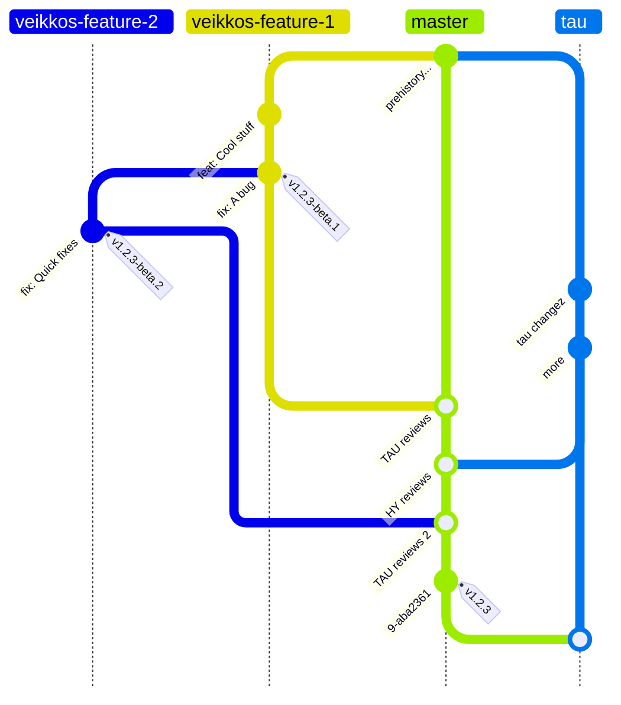

# Aihio Norpan uudeksi prosessiksi

## Alustava ehdotus töiden tiloista

TODO

- Työaihiot
- Eivät vielä määritelty tarpeeksi tarkalle tasolle, että voisivat olla Ready for Development. Tai työtä ei haluta vielä otettavan toteutukseen.
- TAUlla käytössä myös In Analysis-tila, jota käytetään kun työ otettu määrittelyyn ja Waiting-tila jos työtä ei voi edistää syystä X. Näitä ei pakko löytyä Githubista, jos ei nähdä tarpeelliseksi ja ryhmitellään TODOn alle.
- Asetetaan jokin label ‘team’ jos korvamerkitty erityisesti TAU/HY -tiimille?

Ready for Development

- Valmiita otettavaksi toteutukseen, määrittelyn oltava riittävällä tasolla
- Priorisoinnit vaikuttaa siihen milloin otetaan toteutukseen.
- Kuten TODO-tilassa, asetetaan label, jos korvamerkitty erityisesti TAU/HY -tiimille?

In Progress

- Toteutuksessa, tällöin asetetettuna assignee, eli tieto kuka ottanut toteutukseen
- Voidaan myös ylläpitää tietoa siitä, kumpi taho tällöin toteuttajana (kts. label josta ehdotusta TODO ja Ready for Development-tiloissa)

In Review

- Toteuttajan puolelta valmis, odottaa katselmointia tai on katselmoinnissa
  - tiketistä on linkki vastaavaan PR:n

Ready For QA

- Katselmoinnin läpi mennyt työ (joka mergetty masteriin), odottaa releasea ja asentamista testiin.

In QA

- Asennettu testiympäristöön (testi, staging)
- Tämä ja Done haastavia, kumman testissä asennettuna, miten esitettäisiin selkeiten onko työ esim. HYllä Done (tuotannossa) mutta TAUlla vielä Ready For QA (ei asennettuna vielä testiin eikä tuotantoon)
  - labels?

Done

- Asennettu tuotantoympäristöön (production)
- Kts. In QA huomio haastavuudesta

## Workflown alustavaa kuvausta

### Norppaan liittyen tarve muutokselle

- POt erikseen tai yhdessä huomaavat tarpeen ja lisäävät sen backlogille. Tämä voi tapahtua esim. PO:iden suunnittelupalaverissa tai tulla herätteenä käyttäjiltä heille.
- Kehittäjä huomaa tarpeen ja lisää sen backlogille. Tämä voi tulla esim. kun huomataan bugi tai toista työtä tehdessä huomataan tarve muutokselle tai hyödyllinen jatkokehitysidea.
- Työ voidaan samalla priorisoida, eli sijoittaa relevanttiin kohtaan työjonoa
- Tässä yhteydessä voidaan myös jo arvioida tarvitaanko toteutukselle jokin organisaatiokohtainen konfiguraatio.

Tulos:

- _**TODO** tai **Ready for Development** -tilainen työ (töitä) lisätään Norpan backlogille_

### Backlogilla on TODO-tilaisia töitä

- Oleelliset henkilöt kokoontuvat (PO:t tai myös kehittäjiä, tai kehittäjät keskenään) ja täsmentävät työt riittävälle tasolle, että PO:t tietävät toisaalta mitä työn tuloksena tulee ja kehittäjä tietää tarpeeksi toteuttaakseen työn
- Tässä yhteydessä arvioidaan tarvitaanko toteutukselle jokin organisaatiokohtainen konfiguraatio.

Tulos:

- _Töitä siirtyy **Ready for Development** -tilaan Norpan backlogilla_

### Backlogilla on useita Ready for Development -tilaisia töitä

- Oleelliset henkilöt kokoontuvat aika ajoin (PO:t tai myös kehittäjiä) tarkistamaan/ järjestämään töitä prioriteettijärjestykseen, jotta työt toteutetaan olennaisessa järjestyksessä

Tulos:

- _Backlog on prioriteettijärjestyksessä_

### Kehittäjä on valitsemassa seuraavaa työtä

- Oletuksena on, että työjonon kärjestä voi ottaa Ready for Development-tilaisen työn. Kehittäjän huomioitava jos työ korvamerkitty jollekin taholle (TAU, HY)

Tulos:

- _Työ asetetaan **In Progress** -tilaan ja sille merkitään assignee(t)_

### Kehittäjä on saanut työn toteutettua ja testattua

- Työ voi siirtyä katselmointiin, tehdään Pull Request

Tulos:

- _Työ asetetaan **In Review** -tilaan._
  - työtä vastaavasta tiketistä linkki pull requestiin
- Työlle oletuksena tarvitaan hyväksyntä (vähintään “esikatselmointi”) molemmilta tahoilta (joku kehittäjä HYltä hyväksyy ja joku TAUlta hyväksyy) että se voi siirtyä **Ready for QA** -tilaan
- Huomioitava, että tämä ei välttämättä ole toiselta taholta kuin “esikatselmointi” jos ei voi kuin tsekata koodit, eikä järkevää mahdollisuutta ajaa koodia oleellista dataa vasten. Lopullinen katselmointi/testaus/kommentit saattavat tulla vasta kun toinen taho pääsee testaamaan koodin toiminnallisuutta kehitys - ja testiympäristössään (virkistys).
- Vaihtoehtona työ/feature kohtaiselle katselmoinnille olisi release-katselmointi, eli toinen taho katselmoisi useamman työn kerralla vasta release vaiheessa (mietittävä flow tähän, eli että release vaatisi hyväksynnän ennen asennusta testiin tai ainakin ennen tuotantoon menoa).

### Töitä In Review -tilassa

- Ristiin katselmointi/testaus. Tiimistä toinen kehittäjä voi katselmoida koodin ja testata sen olennaisella datalla. Toisen tahon tiimistä myös kehittäjä (esi)katselmoi koodin ja testaa sen mahdollisuuksien mukaan.
- Pyrkimyksenä, ettei työt jää odottamaan pitkäksi aikaa katselmointeja.
- Katselmoinnin aikana katselmoija voi liittää PR:ään kommentteja ja käydä keskustelua myös esim. Slackissa
- Katselmoinnissa voi haastaa myös sitä, onko työn kuvaus Githubissa ajantasalla toteutuksen jälkeenkin.

Tulos:

- _Työ siirtyy **Ready For QA** -tilaan_
- koodi mergattu masteriin

### Tehdyt työt halutaan testiympäristöön

- Tietty/tietyt **Ready For QA** -tilaiset työt halutaan testiin ja sitä kautta myöhemmin tuotantoon.
- Oleelliset henkilöt kokoontuvat tai kommunikoivat (PO:t tai/ja kehittäjiä) ja sopivat mitä releaseen tulee

Tulos:

- _Release muodostettu. Tarpeen mukaan toinen taho vielä katselmoi, jos sitä ei ole tehty feature-tasolla._
- Asennettu release testiin (toiselle taholle vähintään)
- Merkitty johonkin release-tietoihin, että mikä taho asentanut testiin ja aikaleima.
- Releasen työt **In QA** -tilaan. Oltava nähtävissä millä taholla missäkin tilassa?

### Tehdyt työt halutaan tuotantoon

- PO (ja kehittäjät tarpeen mukaan) testaavat työt testiympäristössä ja kun katsottu kaiken toimivan ennalta määritellyllä tavalla, hyväksytään asennus tuotantoon.
- Sovitaan tuotantoasennuksen aikataulu

Tulos:

_Asennettu release tuotantoon (toiselle taholle vähintään)_

- Merkitty johonkin release-tietoihin, että mikä taho asentanut tuotantoon ja aikaleima.
- Releasen työt **Done**-tilaan. Oltava nähtävissä millä taholla missäkin tilassa?

## Muita käytäntöjä

### Bugit/Hotfixit

1. Huomataan bugi
2. Kommunikoidaan myös toiselle taholle löydöksestä (Slack)
3. Sovitaan miten ja mihin releaseen korjattava (jos mennään eri releaseissa)
4. Sovitaan kuka/mikä taho korjaa
5. Lisätään työ Githubiin → jatkuu normaalilla workflowlla

### Release notes

Minimivaatimukset:

- Mitä releaseen sisältyy (mitkä työt)
- Mitä erityistä huomioitavaa
  - Tietokantaan liittyvää tms?
- Konfiguraatio-ohjeet
  - Jos uutta/muuttunutta termistöä
  - Jos uusia/muuttuneita konfiguraatiovakioita
  - Jos jotain oletusarvoja tietokantaan
  - Jos jotain, mikä huomioitava esim. Updaterissa tai muissa lisäosissa
  - Jne.

### Ready For Development (featuren kuvauksen minimivaatimukset)

Löydyttävä osiot:

- Mitä/Miksi (pakollinen)
  - Mitä tehdään ja miksi, mikä on alkuperäinen ongelma/tarve mihin työn toteutus tuo ratkaisun
- Miten (pakollinen)
  - Ylätason kuvaus miten toiminto toteutettava ja mitä huomioitava
  - Tarkempi kuvaus, jos vaatii tarkemman yhteisen teknisen ymmärryksen muutoksesta ja sen vaikutuksesta
- Yliopistokohtaisuudet (mahdollinen)
  - Erikseen huomiot, jos eroavaisuustarvetta TAU/HY välillä esim. konfiguraationa
- Dokumentointi (mahdollinen)
  - Onko määrittelyn aikana tunnistettu tarvetta dokumentoida työhön liittyen jotain johonkin POn tai/ja kehittäjän toimesta tai esim. tarve päivittää käyttöohjeita tuotantoasennuksen yhteydessä?

Kuvattava työ sillä tasolla, että:

- kehittäjä voi sen toteuttaa
- toinen kehittäjä (myös toisella taholla HY/TAU) ymmärtää mitä työssä pitää saada aikaan ja voi siten osata sen katselmoida, tarvittaessa haastaa toteutuksen sekä testata toimivuuden.
- PO ymmärtää
  - voiko hän testata työn sen tultua testiympäristöön (kaikkea ei pysty testaamaan käyttöliittymän kautta)
  - miten hän voi voi testata työn, jotta voi todeta sen toimivan sovitulla tavalla

### Commit notes

- commitin tulee referoida jotakin Githubin issueta, jossa on kuvaus mitä työssä tehdään (kts. Ready for Development)
  - Esim: `fix: Unnecessary slow db query in updateSummaryOnFeedback (#1463)` referoi issueen #1463 ja tulee näkyviin sen historiaan
  - Dokumentaatiomuutokset eivät vaadi tikettiä
- Vaihtoehtoisesti commit tehdään branchiin, josta tehdään PR joka sisältää kuvauksen toteutuksesta ja linkkaa työhön.
- commit-viestiin olennainen tiivistelmä, mitä commit sisältää
  - Tarkempi kuvaus on oltava työn kuvauksessa.

### Releaset

- Dokumentoidaan johonkin se, mikä Githubin release on kummallakin taholla
- mahdollisen virkistyksen alla
- testissä
- tuotannossa

## Git-haarat

